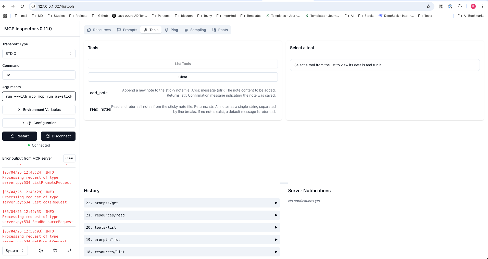
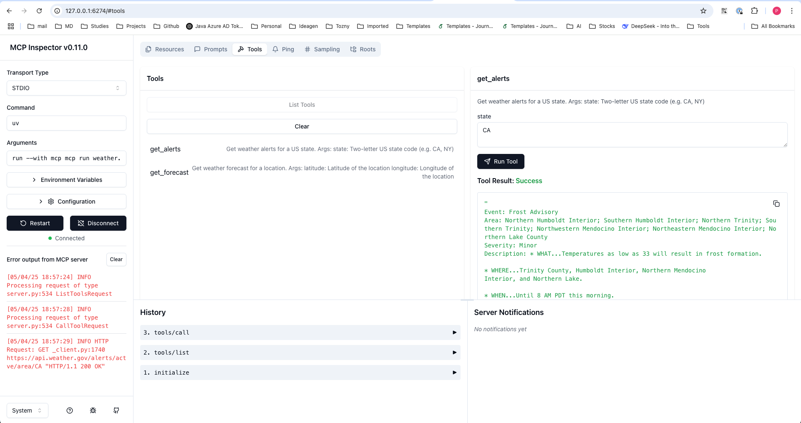

# mcp-server-demo

This is a demo of MCP server.

## Run MCP Server or MCP Inspector

```bash
un run mcp dev weather.py
```

Need to install the following packages:
@modelcontextprotocol/inspector@0.11.0
Ok to proceed? (y) y
Starting MCP inspector...
⚙️ Proxy server listening on port 6277
🔍 MCP Inspector is up and running at http://127.0.0.1:6274 🚀

```bash
uv run mcp dev ai-sticky-notes.py 
```




